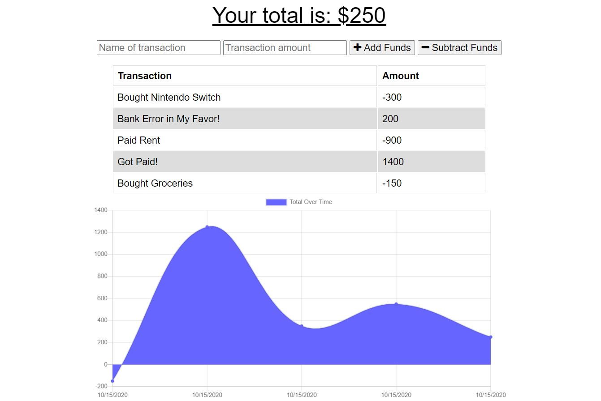

# Online/Offline Budget Tracker
UCI Boot Camp Homework 18 - Online/Offline Budget Tracker

Click [here](https://pwa-budget-tracker-maxx.herokuapp.com/) to open deployed Heroku application.

## Description 
 This was the eighteenth homework assignment for the full stack web development program at UC Irvine, in which the goal was to take a working full stack application and update it so that it can work offline. The application is a budget tracker where the user can input deposits and expenses, view a grand total, and see the displayed data on a graph. Our goal was to make the app completely usable while offline (enter deposits and expenses to the database) and when the app is brought back online, the offline entries should be added to the tracker. This is done through the use of IndexedDB, creating a manifest and service-worker, and storing data in the cache.

## Table of Contents 
* [Technologies](#Technologies)
* [Usage](#Usage)
* [License](#License)
* [Badges](#Badges)
* [Tests](#Tests)
* [Questions](#Questions)

## Technologies 
* This application is written in Javascript and uses MongoDB for creating and reading from a database.
* It uses CSS for styling.
* This application uses the Mongoose ORM for MongoDB and Express for handling routes. 
* It uses a IndexedDB, creation of a manifest and service-worker, as well as methods of saving data to the cache for offline use.
* It requires node.js to run it.

## Usage 
If using from the Heroku deployed application, just go to the deployed application's [link](https://pwa-budget-tracker-maxx.herokuapp.com/). Enter the name of the transaction and the amount of mount (keep the number positive even if subtracting the funds). Click the "Add Funds" or "Subtract Funds" depending on if it is an deposit or an expense, respectively. To test offline functionality, either disable your means of internet connection OR do get to your browser's developer tools, go the Network tab, and click the dropdown that says 'Online'. Set that to 'Offline' and it will simulate a loss of internet connection. You can then refresh the app and continue to use it. Once you regain your internet connection, the entries that were added should remain there. In addition to this functionality, you can also now install this app as a standalone application by going to your Brower's settings and clicking 'Install Budget Tracker App'.

## License 
 ISC

## Badges 
 
 

## Tests 
 No tests are currently in place for this project.

## Questions 
 For any questions, contact me at [maxxsanner105@gmail.com](mailto:maxxsanner105@gmail.com).
#### 
